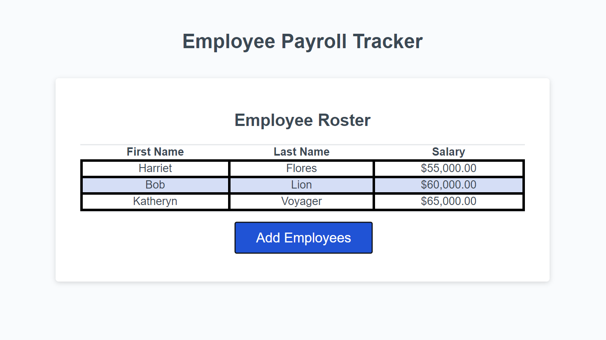

# Employee Payroll Tracker Starter Code

## Description

THis is an employee payroll tracker that will display the average salary of all employees entered, and select a random employee to win a gift card to a local coffee house.

## Instructions for Use

Click on the "Add Employees" button on the screen. Enter the information prompted for by the website. After entering the employee's first name, last name, and yearly salary, you may choose to enter more information (by selecting OK), or finish entering information (by selecting CANCEL). After you are finished entering employee information, a message will be displayed showing the average salary of all employees entered, followed by a message selecting a random employee as a winner for a drawing.

Please use NUMERICAL CHARACTERS ONLY ehn entering salary. The application automatically formats it into USD currency.

## Screenshot

## Credits

For code relating to the input prompt, I used code from w3 Schools.
link: https://www.w3schools.com/jsref/met_win_prompt.asp

For code relating to the window alert function I used code from w3 Schools.
link: https://www.w3schools.com/jsref/met_win_alert.asp

Used code from Geeks for Geeks for selecting random item from the array
link: https://www.geeksforgeeks.org/how-to-select-a-random-element-from-array-in-javascript/

